# Install Addendum – Build and Deploy Instructions

## 1. Overview: Base (BwP) + MCF Add-on

This repository provides the **MCF (Multi-Channel Fulfillment) integration layer** that builds on the **Buy with Prime (BwP) base package** originally published by Perfaware.

- **Full base installation** (the complete BwP accelerator, its documentation, and pre-built binaries/JARs) is available from the Perfaware site: **https://perfaware.com/amazon-buy-with-prime-accelerator/**. Install the base connector first, per Perfaware's documentation. **Redacted reference copies of the base package artifacts are also included locally in this repository under `docs/base_artifacts/` (see section 1.3, Base Package Contents) — use the Perfaware link for the full, unredacted versions.**
- **MCF add-on** (this repository) provides the additional source code and configuration to add native Amazon MCF flows on top of the base.

With this package (V4.7+), the MCF layer is distributed as source code so you can inspect, modify, and version-control the integration and combine MCF flows with the BwP base.

### 1.1 Prerequisites
- IBM Sterling OMS development environment (OMoC or On-Premise)
- Java JDK (version per your Sterling OMS requirements)
- Access to Sterling OMS SDK and build toolchain
- The BwP base package installed per Perfaware's documentation (https://perfaware.com/amazon-buy-with-prime-accelerator/)
- Merchant's existing extensions project structure

### 1.2 Steps

- **Install the BwP base first.** Install the base connector per the Perfaware documentation and binaries (https://perfaware.com/amazon-buy-with-prime-accelerator/).
- **Merge the MCF source.** Merge this repository's source (`src/main/java/`) and extension XML (`files/extensions/`) into your Sterling extensions project, following IBM's standard extensions approach.
- **Merge the properties.** Merge the properties from `amzConn_customer_overrides.properties` into your `customer_overrides.properties` (or DB properties).
- **Build the JAR.** Build using your standard Sterling OMS build process (e.g., Maven or Gradle as configured for your environment).
- **Deploy the JAR** to your Sterling OMS runtime.
- **Import the configuration package.** Import `amzConn_config_omoc.zip` via CDT as described in the main connector document.

**Note: The amzConn_customer_overrides.properties file contains placeholder values for API credentials. Replace these with your merchant-specific Amazon API credentials before deployment. Do NOT use the sample values provided.**

### 1.3 Base Package Contents

The artifacts under `docs/base_artifacts/` are **redacted copies of the Perfaware base package artifacts** — all API credentials (client IDs, client secrets, refresh tokens, access keys, target IDs) have been replaced with placeholders, and internal host references removed. They are provided here **for reference only**.

**For the full, unredacted Perfaware artifacts** — including the complete base package, documentation, and pre-built binaries/JARs — **refer to the Perfaware site: https://perfaware.com/amazon-buy-with-prime-accelerator/**

Redacted reference artifacts included in this repository:

- `amzConn_config_omoc.zip` — Configuration XML files for OMoC deployment (redacted)
- `amzConn_customer_overrides.properties` — Required properties (credential placeholders)
- `amzConn_properties_multiAPI.xml` — Properties for DB-based property management (redacted)

## 2. Queue Management

Launch configurator, Navigate to application platform(Default) -> Queue Management
Click + icon to create new queue, enter the queue details as given below:

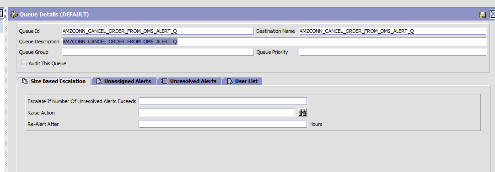

## 3. Services
**AmzProcessReleaseCreationOrChangeMsg**
Launch configurator, Navigate to application platform(Default) -> Process Modeling ->  Order Fulfillment -> Service Definition Framework.
Click on + icon to create a new service, enter service details as given below:

Drag and drop the api component, connect start to api component, Click on Api component and select the extended api, enter the api details as given below:

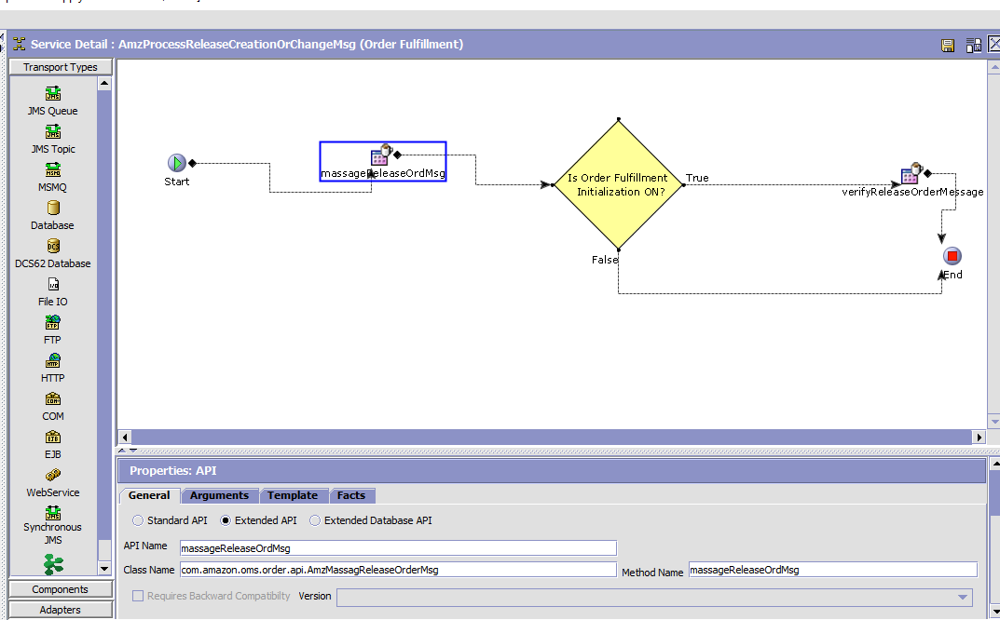

Drag and drop the condition, connect 1st api component to condition, and select the below condition from drop down.
**Condition**

drag and drop one more api component, connect condition to true 2nd api component and false to an End.

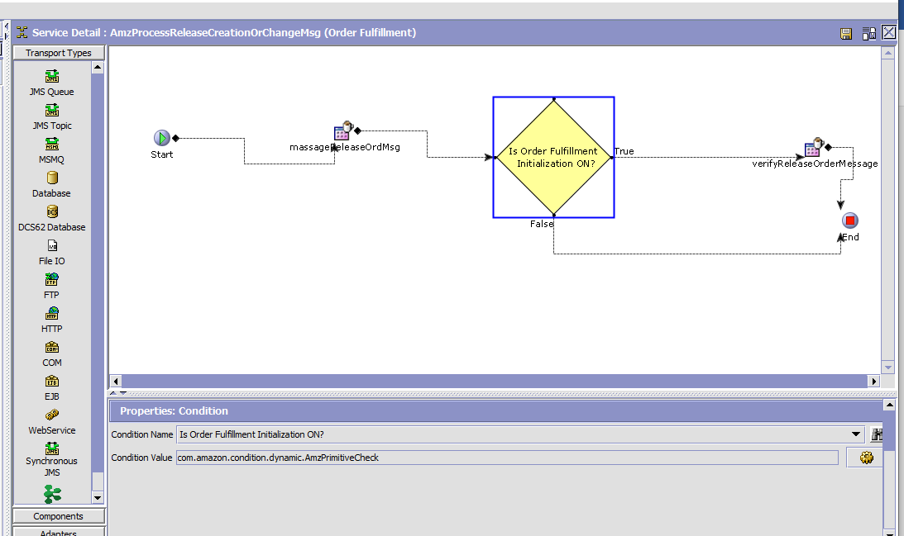

Click on 2nd api component, select extended api, enter the api details as given below
**verifyReleaseOrderMessage**

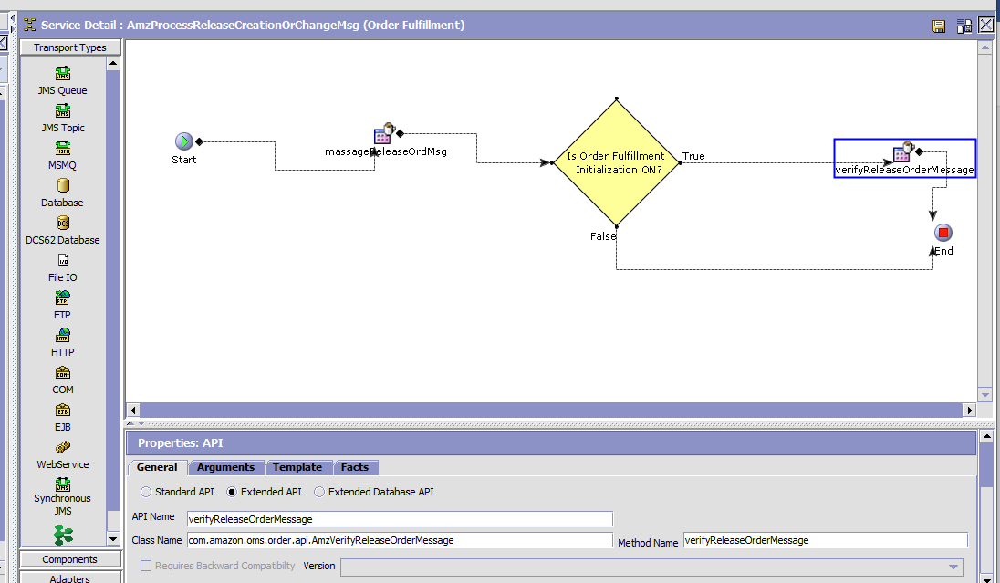

Connect 2nd Api component to end and save the service.

**AmzProcessCreateAndReleaseOrdMsgAsync:**

Launch configurator, Navigate to application platform(Default) -> Process Modeling ->  Order Fulfillment -> Service Definition Framework.
Open AmzProcessCreateAndReleaseOrdMsgAsync Service update the config as below:
Add 2 condition after Is Order Fulfillment Routing ON? Condition, add same condition twice i.e Is Release Message?
From Is Order Fulfillment Routing ON? True to Is Release Message? Condition, Is Release Message? Condition true to UpdateAmzOrderAndCreateOrderInAmzon api component and false to CreateBWPAmazonOrder api component, connect UpdateAmzOrderAndCreateOrderInAmzon and CreateBWPAmazonOrder api components to End.
From Is Order Fulfillment Routing ON? True to Is Release Message? Condition, Is Release Message? Condition true to verifyAndUpdateAmzOrdExecutionState api component and false to End.
Click on UpdateAmzOrderAndCreateOrderInAmzon api and enter the extended api details as given below:

Click on CreateBWPAmazonOrder api and enter the extended api details as given below:

Click on verifyAndUpdateAmzOrdExecutionState api and enter the extended api details as given below:

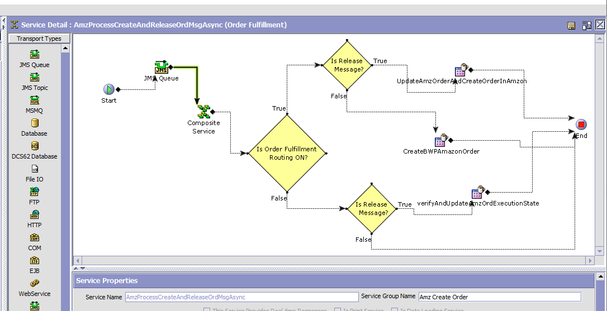

Save the service.

**AmzConnOrderCancelReqestSync:**
Launch configurator, Navigate to Application manager (Default) -> Process Modeling -> Order Fulfillment -> Services.
Create Service with details as given below:

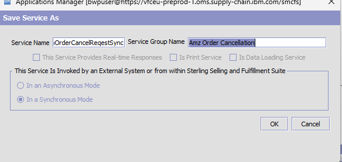

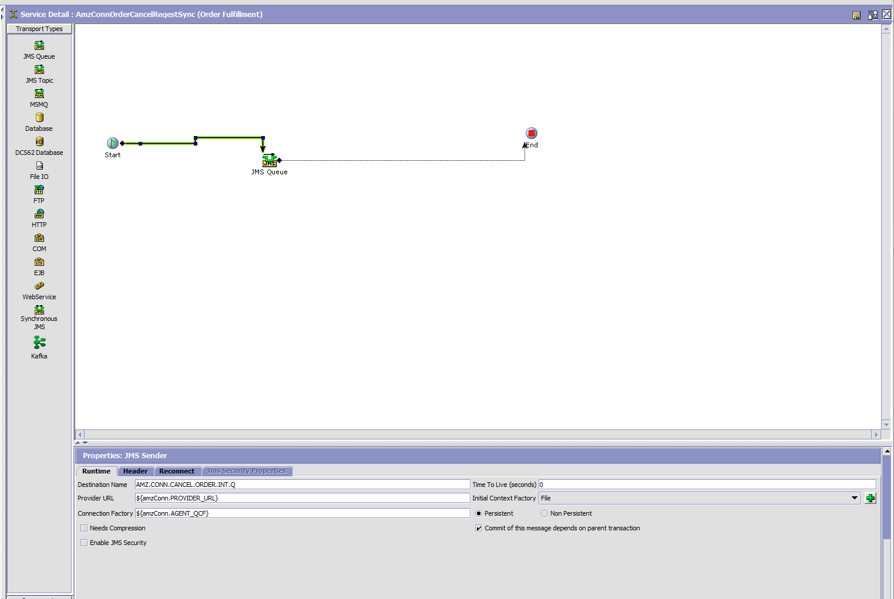

Drag and Drop the api component:
Enter runtime details as given below:

Connect the start to Queue, Queue to End, and save the service.

**AmzConnOrderCancelReqestAsync:**

Launch configurator, Navigate to Application manager (Default) -> Process Modeling -> Order Fulfillment -> Services.
Create Service with details as given below:

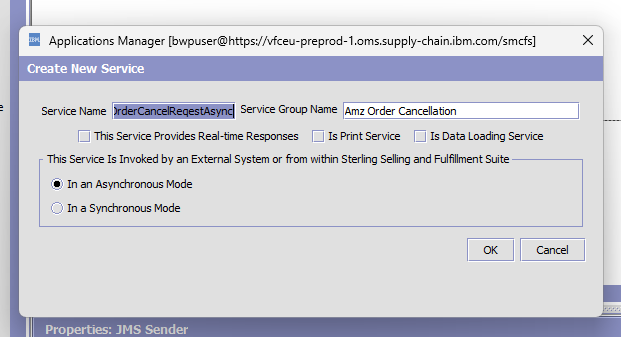

Drag and drop the JMS queue and api component, connect start to JMS Queue, JMS queue to api component and api component to end.

Enter runtime JMS properties as given below:

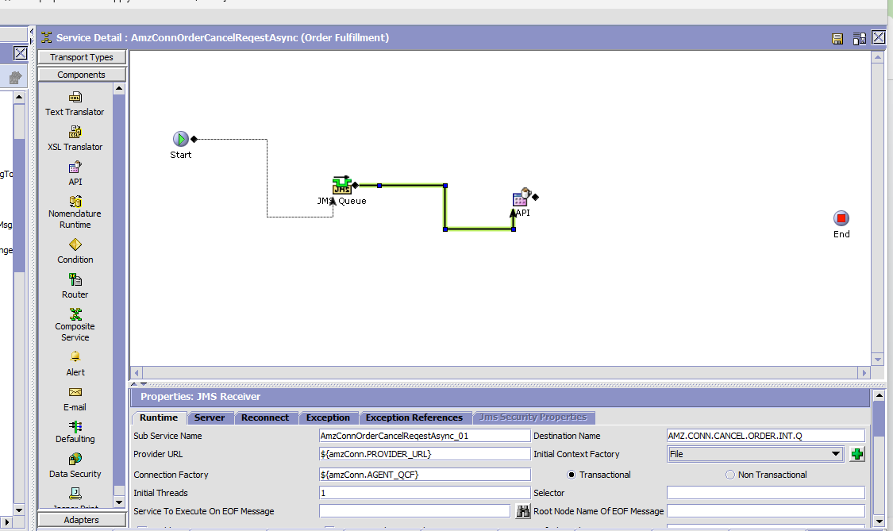

Under Server tab, create the server AmzConnProcessOrderCancelMsgFromOMSInteg

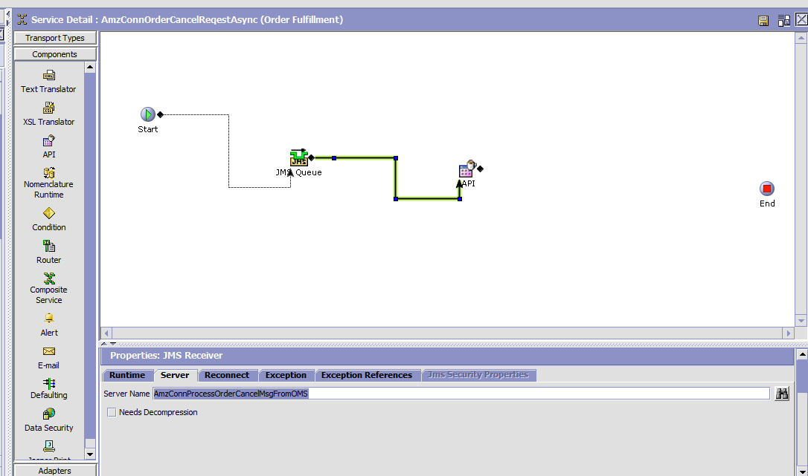

Navigate to Exception tab enter the details as given below:

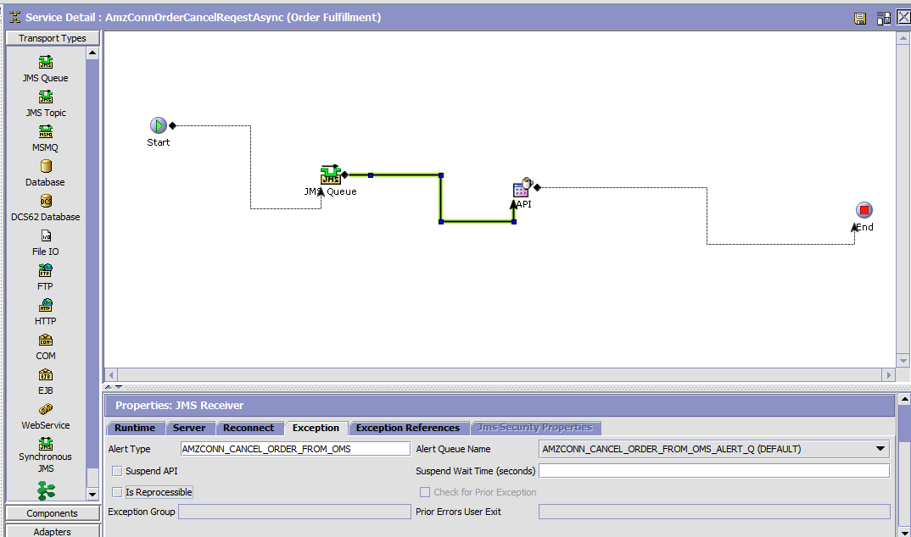

Click on the api component, select extended api and enter the api details as given below:

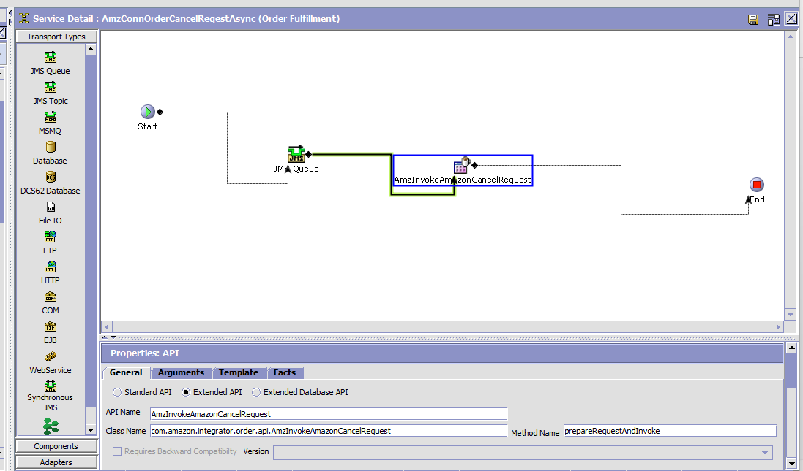

Save the service, and start server from SST.

**AmzConnGetEventsList:**
Launch configurator, Navigate to Application Platform(DEFAULT) -> Process Modeling -> Reverse Logistics -> SDF -> Amz Return (Service group).
Click on + icon to create a new Service.
Enter service details as below:

Drag and drop the api component, select the extended database api, select getAmzConnEventsList api from drop down.

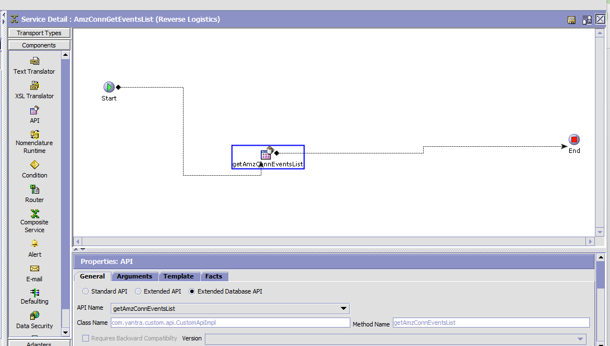

Save the service.

**AmzConnCreateEventsList:**
Launch configurator, Navigate to Application Platform(DEFAULT) -> Process Modeling -> Reverse Logistics -> SDF -> Amz Return (Service group).
Click on + icon to create a new Service.
Enter service details as below:

Drag and drop the api component, select the extended database api, select createAmzConnEvents api from drop down.

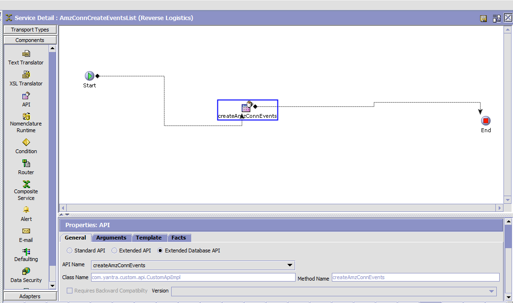

Save the service.

**AmzConnUpdateEventsList:**
Launch configurator, Navigate to Application Platform(DEFAULT) -> Process Modeling -> Reverse Logistics -> SDF -> Amz Return (Service group).
Click on + icon to create a new Service.
Enter service details as below:

Drag and drop the api component, select the extended database api, select changeAmzConnEvents api from drop down.

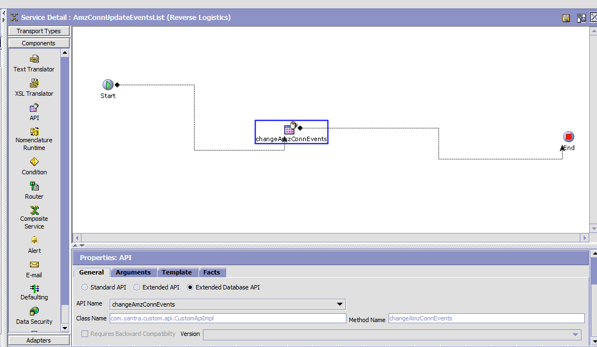

Save the service.

## 4. Actions
**Amz Release Creation Or Change**

Launch configurator, Navigate to application platform(Default) -> Process Modeling ->  Order Fulfillment -> Actions.
Click on + icon and create new as below:

Save the action, enable Invoke the following service as part of this action.
Flow name: AmzProcessReleaseCreationOrChangeMsg

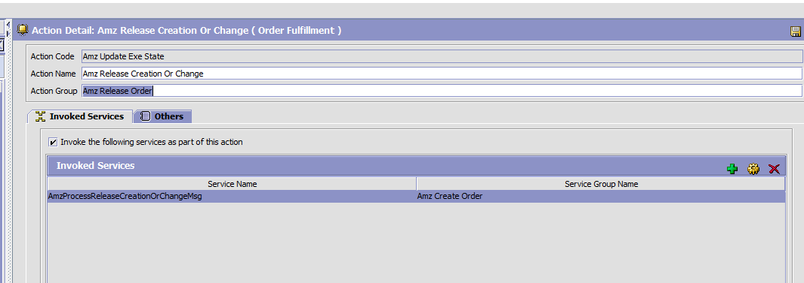

Save the Action.

**Amz Order Cancel**

Launch application platform(DEFAULT) -> Process Modeling -> Order Fulfillment -> Action -> Amz Order Cancel (Action group).
Open action Amz Order Cancel.
Remove the AmzConnOrderCancelRequest flow and add the AmzConnOrderCancelRequestSycn Service.

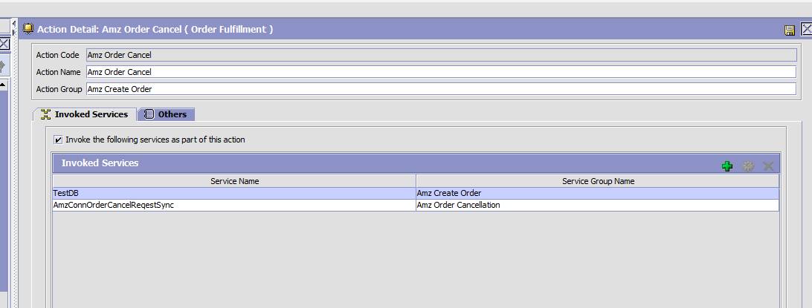

Save the action.

## 5. Event Changes

**ReleaseOrder (on Success ) –  Launch configurator, Navigate to application platform(Default) -> Process Modeling ->  Order Fulfillment -> Transaction.**
Disable the Release Order On Success event or remove the Amz Release Order On Success action from release order On Success event Handler.

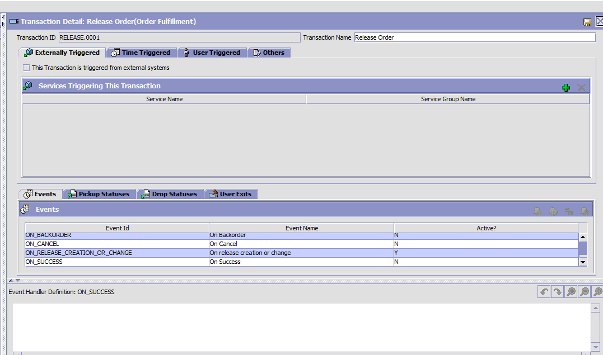

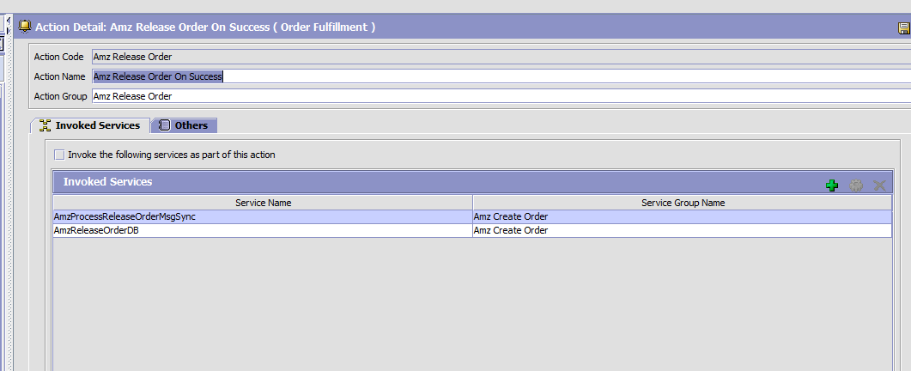

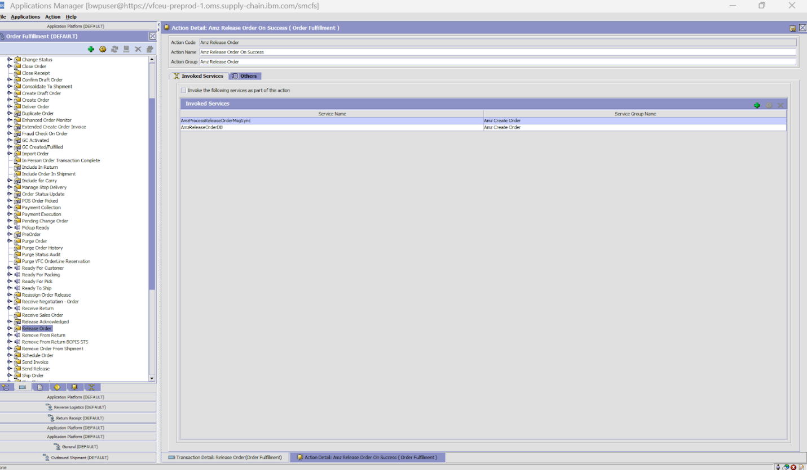

Save the transaction.

**ReleaseOrder (ON_RELEASE_CREATION_OR_CHANGE ):**
**– This event is related to Amazon Fulfillment Initiated and Amazon Order creation for MCF lines.**

Launch configurator, Navigate to application platform(Default) -> Process Modeling ->  Order Fulfillment -> Transactions.
Open Release Order Transaction, under Events Enable the ON_RELEASE_CREATION_OR_CHANGE event.Drag and drop the Amz Release Creation Or Change action into the ON_RELEASE_CREATION_OR_CHANGE event.

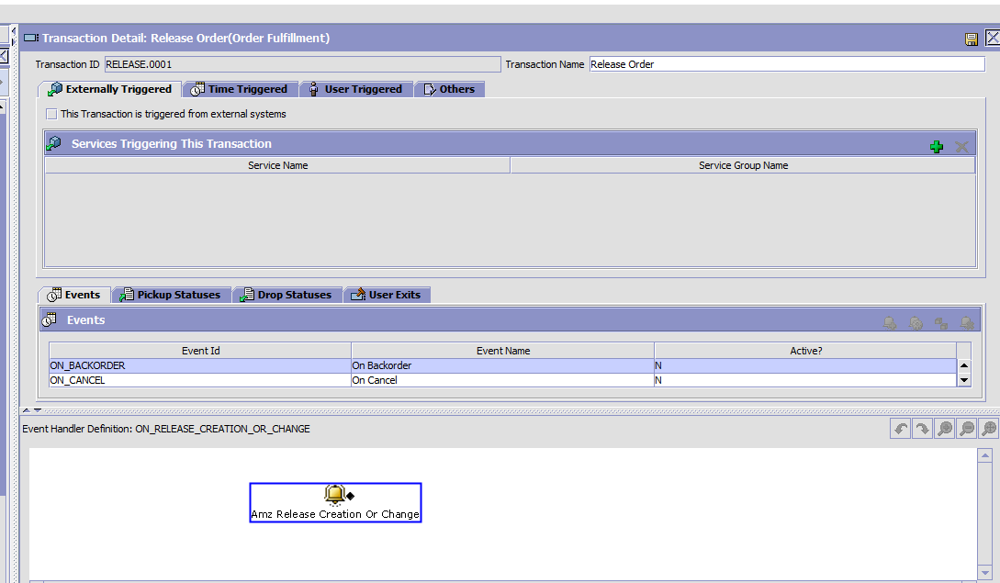

**Change Order On Cancel event:**
Launch configurator, Navigate to Application manager (Default) -> Process Modeling -> Order Fulfillment -> Transactions:
Open change Order transaction under Events, enable the ON_CANCEL event.
Drag and drop the Amz Order Cancel Action into the Change Order ON_CANCEL event handler:

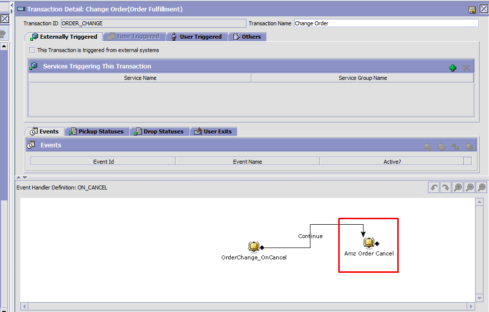

Save the Transaction.

## 6. Common Code Changes
Below Common Codes need to be Added/Modified.

## 7. SST
### 7.1 AMZ.CONN.CANCEL.ORDER.INT.Q : Queue
Queue details:

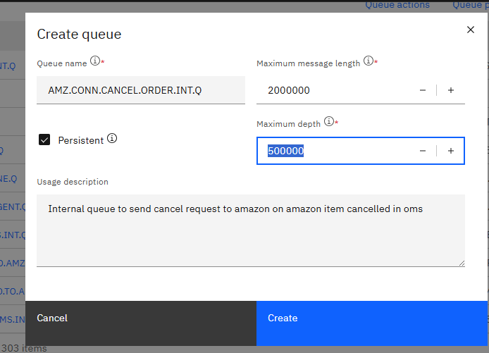

Click on Create.

### 7.2 AmzConnProcessOrderCancelMsgFromOMSInteg : Integration Server
**Login to SST, under Server tab, configure and start AmzConnProcessOrderCancelMsgFromOMSInteg integration server.**
